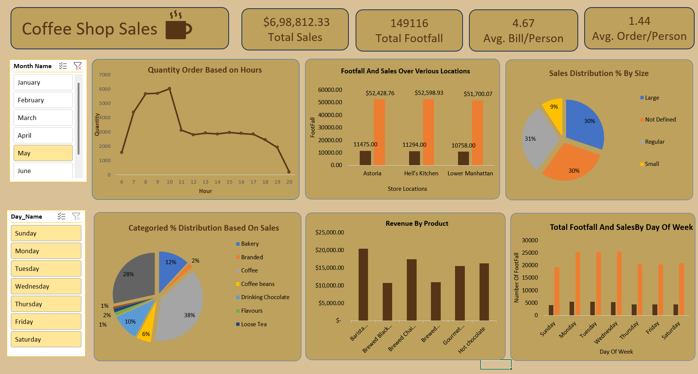

# ☕ Coffee Shop Sales Analysis Dashboard

## 📌 Project Overview
This project focuses on analyzing **Coffee Shop sales data** to uncover insights that help improve business performance.  
The interactive dashboard is built entirely in **Microsoft Excel**, showcasing key metrics such as sales, footfall, peak hours, and product performance.  

The goal of this project is to support **data-driven decision-making** by identifying trends, patterns, and opportunities in the coffee shop’s operations.

---

## 📊 Key Insights from Dashboard
- **Total Sales:** $6,98,812.33  
- **Total Footfall:** 149,116  
- **Average Bill per Person:** $4.67  
- **Peak Order Hours:** 8 AM – 11 AM  
- **Top Performing Locations:** Astoria, Hell's Kitchen, Lower Manhattan  
- **Best-Selling Category:** Coffee (38%)  

🎥 [View Dashboard Walkthrough (Video)](https://github.com/rohanhake98/Coffee-Shop-Sales-Analysis-On-Excel/blob/main/Screen%20Recording%202025-09-22%20225057.mp4)

---

## 🔎 Analysis Performed
- Sales and footfall trends by **day of the week** and **hour of the day**  
- Location-wise sales performance comparison  
- Product analysis by category, type, and size  
- Identification of **best-selling products** in terms of revenue and quantity  
- Monthly sales revenue breakdown  

---

## 🛠 Tools & Techniques Used
- Microsoft Excel  
- Pivot Tables & Pivot Charts  
- Slicers for interactive filtering  
- Data cleaning & transformation  

---

## 📂 Project Structure
├── Coffee Shop Sales Analysis.xlsx # Excel workbook with cleaned data & dashboard
├── Dashboard-img.png # Snapshot of the dashboard
├── Coffee Shop Sales Analysis.pdf # Project report with key questions & insights
└── README.md # Project documentation

text

---

## 🚀 Learning Outcomes
- Hands-on experience with Excel dashboards & interactive reports  
- Ability to derive **business insights** from raw sales data  
- Improved skills in **data visualization** and storytelling with data  

---

## 📸 Dashboard Preview

---

## 📢 Conclusion
This project demonstrates how **Excel can be a powerful tool** for building interactive dashboards and extracting valuable insights from sales data. The analysis helps answer critical business questions such as:  
- When do sales peak?  
- Which locations perform best?  
- Which products drive the most revenue?  

---

## 🔖 Tags
#DataAnalytics #Excel #Dashboard #CoffeeShop #DataVisualization #BusinessIntelligence
